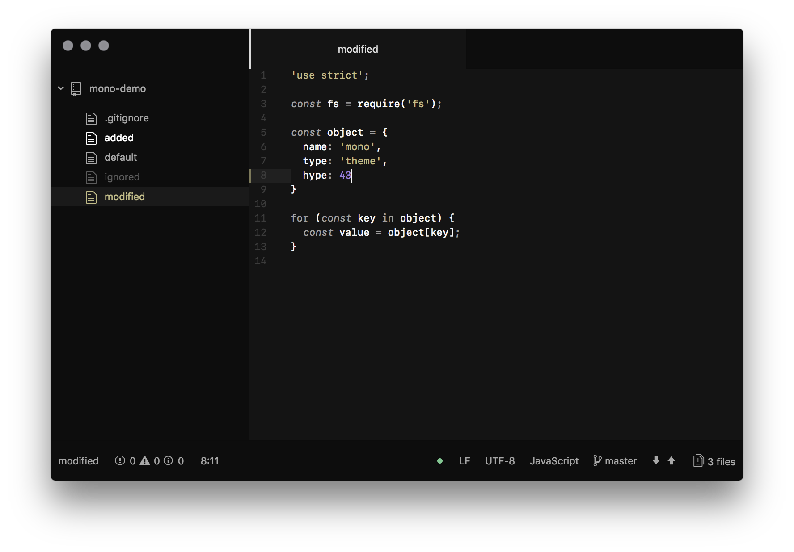

# Mono Syntax

A mostly monochrome dark syntax theme for [Atom](https://atom.io).

Lots of greys for lots of things, yellow for strings, purple for numbers and
booleans.

Mono Syntax with the [Mono UI](https://github.com/chrstphrknwtn/mono-ui).
